Hyprland v0.54.2 port. The upstream GL shader hook approach is incompatible with Hyprland's refactored render pipeline (v0.40+). This is a complete rewrite targeting the v0.54.2 API.

## Architecture

```mermaid
flowchart LR
    subgraph upstream ["Upstream (broken on v0.54+)"]
        direction LR
        A[Window render] --> B[registerCallbackDynamic hook]
        B --> C[GL shader compilation intercept]
        C --> D[Swap tint.glsl at runtime]
        D --> E[Output]
    end

    subgraph fork ["This fork (v0.54.2)"]
        direction LR
        F[Window render] --> G[RENDER_POST_WINDOW event]
        G --> H{visible workspace?\nper-frame guard?}
        H -- pass --> I[CRectPassElement\nrounding + alpha + offset]
        H -- skip --> J[no-op]
        I --> K[Output]
        J --> K
    end

    style upstream fill:#2a1a1a,stroke:#cc4444
    style fork fill:#1a2a1a,stroke:#44aa44
```

The upstream implementation swaps tint shaders at GL compile time (6 source files, `registerCallbackDynamic`). That internal renderer state was removed in Hyprland v0.40.

This port injects a `CRectPassElement` overlay into the render pass at `RENDER_POST_WINDOW`. The overlay inherits window rounding, tracks workspace animation offsets, and prevents double-exposure on the active window via a per-frame guard set.

## Diff

|                     | Upstream                 | v2.0.0                   |
|---------------------|--------------------------|--------------------------|
| Source              | 6 files                  | 1 file, 250 LOC          |
| Render method       | GL shader swap           | CRectPassElement overlay |
| Event API           | registerCallbackDynamic  | Event::bus()             |
| Workspace animation | None                     | Render offset applied    |
| Ghost window layers | Present                  | Fixed (m_visible guard)  |
| Target              | Hyprland <= v0.36        | Hyprland v0.54.2         |

Configuration keys (`plugin:darkwindow:*`) are unchanged from upstream.

## Build environment

Tested against Hyprland `59f9f268` (v0.54.2), Hyprutils 0.11.0, Hyprlang 0.6.8, Aquamarine 0.10.0, NixOS 26.05 (Yarara).

## Credits

- [alexhulbert/Hyprchroma](https://github.com/alexhulbert/Hyprchroma) — original plugin
- [micha4w/Hypr-DarkWindow](https://github.com/micha4w/Hypr-DarkWindow) — ancestor project
